# Integración Continua
## Frontend

---

### whoami


Ricardo Vega

Arquitecto de soluciones Front
Minsait Valladolid

👾 📺 📕 🍳 💻

@fa[twitter] [@ricveal](https://twitter.com/ricveal) <br/>
🌐 https://ricveal.com

---

## Objetivos

- Optimización
- Mejorar entorno de desarrollo
- Calidad de código
- Estandarización
- Mejorar el bucle de feedback
- Reducir el "Time to Market", tiempos de desarrollo, etc...

---

## Etapas de madurez

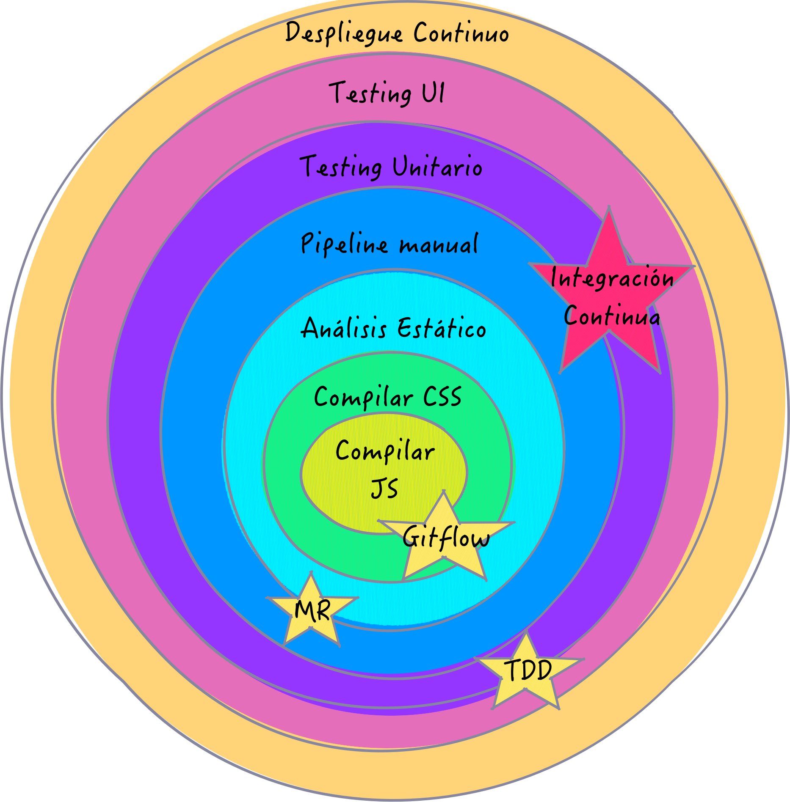

Note:
* GitFlow (u otra metodología) aparece entre 1 y 2.
* CodeReview y Merge Request entre 3 y 4.
* Pipeline Automático - Integración continúa entre 4 y 6.
* TDD entre 5 y 6.

---?image=assets/images/modern-web.jpeg

## Frontend moderno

- **S**ingle **P**age **A**pplications
- Gran dependencia de Javascript

---

## Compilación

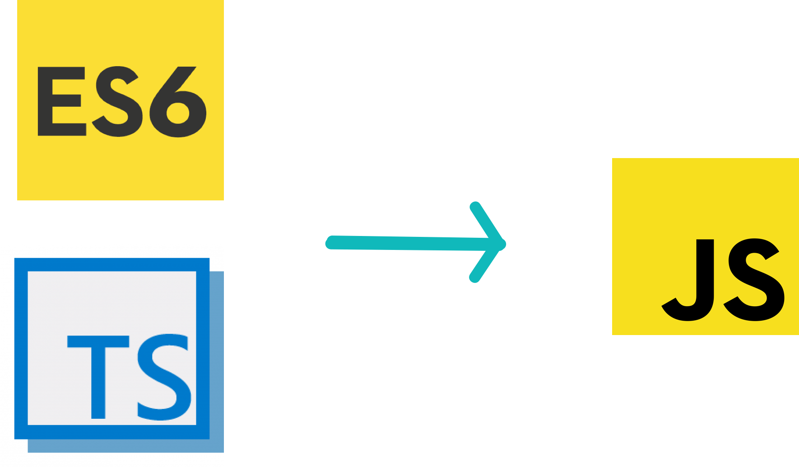

+++


CSS

+++

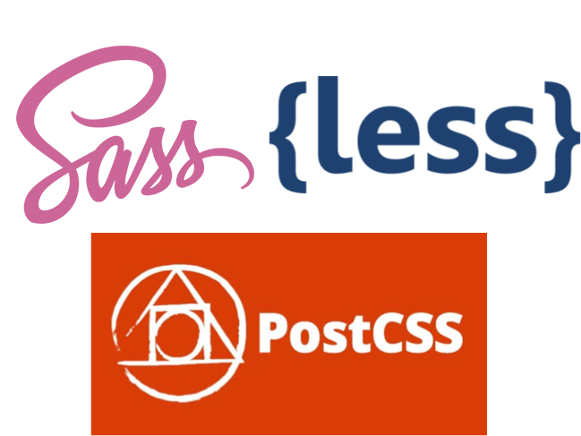

+++?image=assets/logos/webpack.png

### Webpack

---

## Análisis estático

- Estandarización y calidad de código


---

## Pipeline manual

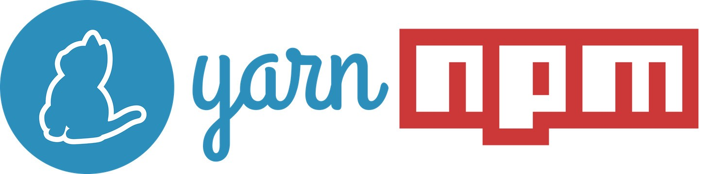

+++

#### package.json

```json
{
  "name": "demo",
  "version": "1.0.0",
  "license": "MIT License",
  "scripts": {
    "start": "npm run serve",
    "start:mock": "npm-run-all --parallel serve:mock mock",
    "serve": "webpack-dev-server --env.NODE_ENV=development",
    "serve:mock": "webpack-dev-server --env.NODE_ENV=development-mock",
    "build": "webpack --env.NODE_ENV=production",
    "build:dev": "webpack --env.NODE_ENV=development",
    "test": "jest",
    "coverage": "jest --coverage",
    "test:watch": "jest --watch",
    "format:fix": "pretty-quick --staged",
    "precommit": "run-s format:fix intl:lint lint test",
    "lint": "ng lint",
  },
  "dependencies": {
    "your-favorite-dependencies": "1.0.0"
  },
  "devDependencies": {
    "chalk": "^2.4.1",
    "circular-dependency-plugin": "^4.2.1",
    "copy-webpack-plugin": "~4.4.1",
    "file-loader": "^1.1.5",
    "html-webpack-plugin": "^2.29.0",
    "husky": "^0.14.3",
    "jest": "^22.4.3",
    "mockdate": "^2.0.2",
    "nodemon": "^1.17.3",
    "npm-run-all": "^4.1.2",
    "prettier": "^1.11.1",
    "pretty-quick": "^1.4.1",
    "raw-loader": "^0.5.1",
    "sass-loader": "^6.0.6",
    "tslint": "~5.9.1",
    "uglifyjs-webpack-plugin": "^1.1.8",
    "url-loader": "^0.6.2",
    "webpack": "~3.11.0",
    "webpack-dev-server": "~2.11.0"
  }
}
```

@[5-18]

+++

### Git hooks

Husky

```json
{
  "husky": {
    "hooks": {
      "pre-commit": "npm test",
      "pre-push": "npm test",
      "...": "..."
    }
  }
}
```

---?image=assets/images/chuttersnap-233105-unsplash.jpg

## Testing

+++

## Todo el mundo hace testing:

* Testing manual: tarea aburrida y repetitiva.
* Testing automático:
    * Rápido: un click lanza todos los tests.
    * Refactorizar sin miedo.

+++

### Características del Testing

* Fiable
* Mantenible
* Flexible

+++

### Pirámide de Test - Mike Cohn

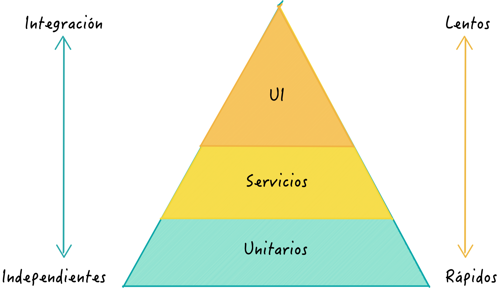

+++

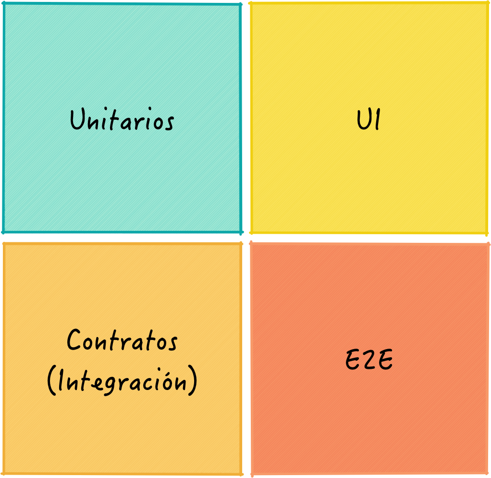

```javascript
E2E Test !== UI Test
```

+++

### Herramientas de testing

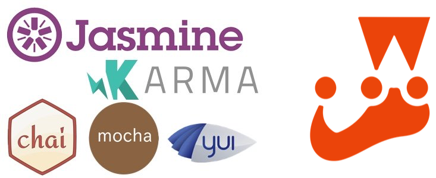

Note:
Runners (ejecutores / lanzadores):
- Karma
- Mocha
- **Jest**
Librerías de testing:
- Chai
- Jasmine
- **Jest**

+++

#### Testing de UI

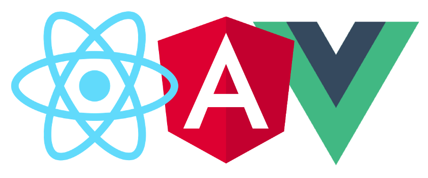
- Enzime (React)
- Vue-Test-Utils (Vue)
- @angular/core/testing (Angular)

+++

### A tener en cuenta:

- El código de un test es importante.
- 1 condición por test.
- "Given When Then".
- Legible.

+++

#### Documentación en código

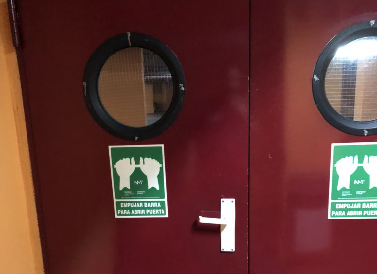

+++

### Test Driven Development (TDD)

Hacer el test primero convierte el código en testeable.

---?image=assets/images/kotagauni-srinivas-481125-unsplash.jpg

## Metodología

+++

### GitFlow

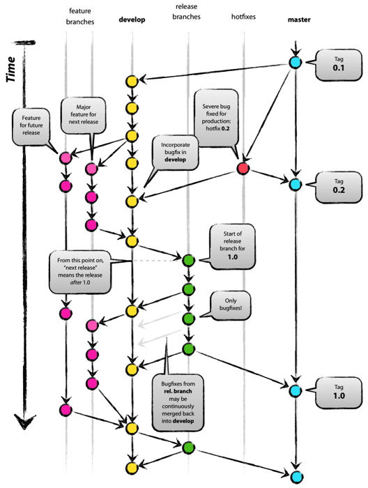

+++

### Merge Request

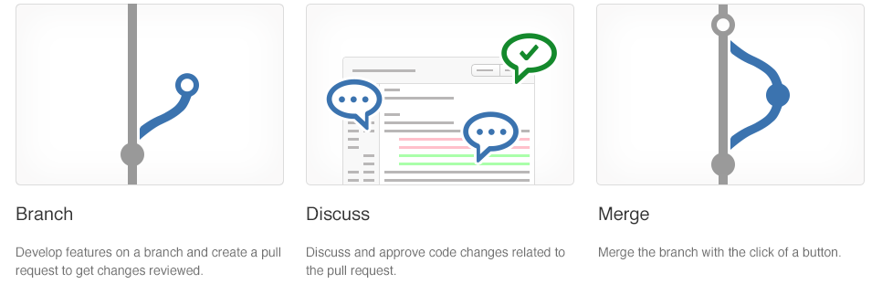

+++

### Revisión de Código

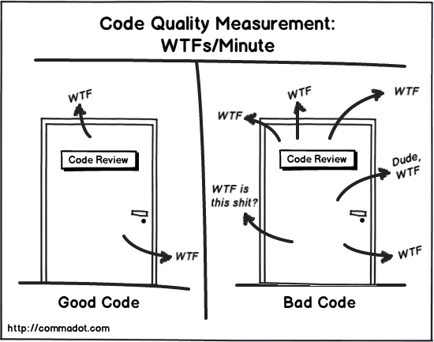

---?image=assets/images/janko-ferlic-193843-unsplash.jpg

## Integración Continua

+++

### Pipeline as a Code

Integración continúa en control de versiones.

+++


+++

```yaml
image: node:latest

cache:
  untracked: true
  key: "$CI_BUILD_REF_NAME"
  paths:
    - node_modules/

stages:
  - setup
  - test
  - deploy

setup:
  stage: setup
  script:
    - npm install

eslint:
  stage: test
  script:
    - npm run lint

test:
  stage: test
  script:
    - npm run test
  coverage: /All files[^|]*\|[^|]*\s+([\d\.]+)/

deploy:
  stage: deploy
  script:
    - echo "DEPLOY"
```
+++

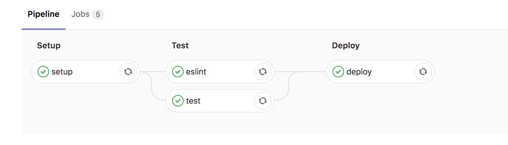

+++

### Otras opciones:

- Jenkins
- BitBucket
- Visual Studio Team Services
- Travis
- Circle CI

---

## Despliegue automático

+++

Despliegue "Agile"

vs

Despliegue continúo

---


> "La cultura se come a la estrategia para desayunar."

Peter Drucker

---

## ¡Muchas gracias!

@fa[github] [ricveal](https://github.com/ricveal) <br/>
@fa[twitter] [@ricveal](https://twitter.com/ricveal) <br/>
@fa[globe] https://ricveal.com </br>
@fa[envelope] rvalonso@minsait.com <br/>
